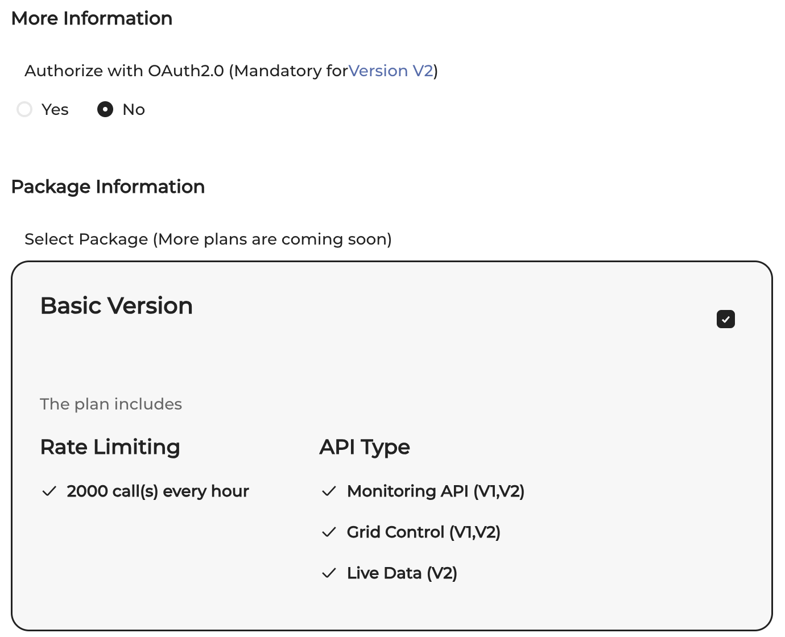

# Sungrow API Client

[](https://github.com/Afrouper/sungrow-api-client/actions/workflows/maven.yml)
[](https://github.com/Afrouper/sungrow-api-client/actions/workflows/github-code-scanning/codeql)
[](https://github.com/Afrouper/sungrow-api-client/actions/workflows/dependabot/dependabot-updates)


API Client which uses the official API from the [sungrow developer portal](https://developer-api.isolarcloud.com/).

The Client is still in development and not finished.

> [!NOTE]
> Pull requests to complete APIs are welcome 

> [!IMPORTANT]
> I choose a very simple implementation to get this client used in different environments; without coming to "dependency hell".

## ToDos
- [x] Add github actions for compile, dependabot and securiy issues
- [x] Add sample client for basic usage
- [x] Support encrypted API calls (open: Change password for each call)
- [ ] Add release action
- [x] Mock JUnit Test
- [ ] **More** JUnit Test
- [ ] Deploy via Maven Central
- [ ] Complete API

# Usage
You have to create an account at Sungrows iSolarCloud and on their developer portal and get the needed
credentials (see [Sungrow Developer Portal](#Sungrow Developer Portal))

A sample can be found at [Client.java](src/test/java/de/afrouper/server/sungrow/Client.java). If not provided the needed properties are read from
a Java SystemProperty and (if not found) from an environment variable:

| SystemProperty / Environment variable | meaning                                                |
|---------------------------------------|--------------------------------------------------------|
| APP_KEY                               | Your app key from Sungrow Developer Portal             |
| SECRET_KEY                            | Your secret key from Sungrow Developer Portal          |
| ACCOUNT_EMAIL                         | EMailadress used for login to Sungrow Developer Portal |
| ACCOUNT_PASSWORD                      | Password used for login to Sungrow Developer Portal    |
| RSA_PUBLIC_KEY                        | RSA Public key to call APIs E2E encrypted              |
| API_CALL_PASSWORD                     | Password for payload encryption                        |

The URL for accessing the correct cloud service is determined from the [Region](../src/main/java/de/afrouper/server/sungrow/api/SungrowClientFactory.java) Enum. 

```java
SungrowClient sungrowClient = SungrowClientFactory.createSungrowClient(SungrowClientFactory.Region.EUROPE);
sungrowClient.login();

PlantList plantList = ApiOperationsFactory.getPlantList();
sungrowClient.execute(plantList);
System.out.println("Plants: " + plantList.getResponse().getPlants());
```

# Sungrow Developer Portal

Currently only the access for private customers can be used.
Use your sungrow credentials to login at "https://developer-api.isolarcloud.com".
You need to create an application; go to you applications in the top menu:


Click 'Create Application'. After this fill out the needed informations and be sure that you
do **not** choose "OAuth2.0": 



# Develop new APIs
Please read the docs at the [Developer Portal](https://developer-api.isolarcloud.com/#/document/md?id=10942&project_id=2&version=V1).

To create a new API refer the existing one such as `de.afrouper.server.sungrow.api.operations.DeviceList`.
You have to create a class per API and the corresponding request and response objects.